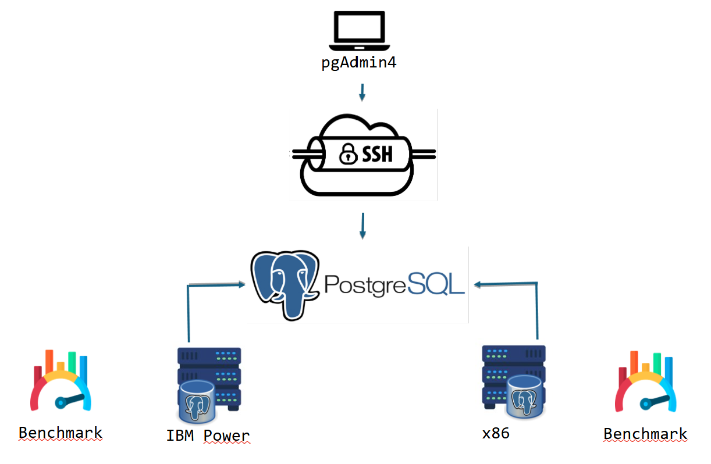

# Pasos para hacer la demo de postgres con pgbench

## Resumen del proyecto
Este proyecto tiene como objetivo comparar el rendimiento de dos arquitecturas de hardware IBM POWER y x86 mediante la evaluación de su desempeño en la ejecución de transacciones sobre una base de datos PostgreSQL. Utilizando herramientas como pgbench, se medirá la cantidad de transacciones por segundo (TPS) que cada plataforma es capaz de procesar bajo condiciones similares de carga y configuración.

El propósito es proporcionar una visión clara sobre las capacidades y ventajas del hardware IBM POWER en comparación con la arquitectura x86, evidenciando sus diferencias a nivel de rendimiento, paralelismo y eficiencia en operaciones de base de datos.

Además, este proyecto busca servir como guía técnica para la instalación, configuración y ejecución de pruebas de rendimiento con PostgreSQL, facilitando así futuras implementaciones sobre arquitecturas POWER para entornos que requieran alta eficiencia y confiabilidad.
## Arquitectura

## Requerimientos
- PuTTy (opcional)
- Maquina POWER
- Maquina x86
- pgAdmin 4 (opcional)
- WinSCP (opcional)

# Instalacion de la demo

### Paso 1: instalar postgres
```
sudo dnf install postgresql-server postgresql-contrib -y
```
### Paso 2: utilizar
```
/usr/bin/postgresql-setup --initdb
```
### Paso 3: modifica el pg_hba.conf
```
nano vi /var/lib/pgsql/data/pg_hba.conf
```

`IPv4 local connections:`
```
host    all             all             0.0.0.0/0            md5
#host    all             all             127.0.0.1/32            ident
```
### Paso 3.5: cambiar la config o cargar la config subida al Github
```
nano /var/lib/pgsql/data/postgresql.conf
```
### Paso 4: cambiar algunos parametros (necesario este)

`listen_addresses = '*'`

Suele ser necesario reiniciar el servicio de postgres para que los cambios permanezcan

```sudo systemctl restart postgresql```

### Paso 5: cambiar la contraseña del usuario consola postgres (min. 8 caracteres)
```
sudo passwd postgres
```
### Paso 6: cambiar la contraseña del usuario db postgres
utiliza este codigo en el root si durante este proceso no funciona algo `sudo systemctl restart postgresql`
```
sudo -i -u postgres
psql
ALTER USER postgres WITH PASSWORD 'nueva_contraseña_segura';
exit
exit
```
### Paso 7: importa y descomprime la dvdrental
```
wget https://www.postgresqltutorial.com/wp-content/uploads/2019/05/dvdrental.zip
unzip dvdrental.zip
```
### Paso 8: 
```
cp dvdrental.tar /var/lib/pgsql/
chown postgres:postgres /var/lib/pgsql/dvdrental.tar
```
### Paso 9: entra a postgres como user
```
sudo -i -u postgres
```
### Paso 10: crea una nueva database llamada dvdrental
```
createdb dvdrental
```
### Paso 11: restaura el backup dentro de la dvdrental database y sales
```
pg_restore -U postgres -d dvdrental dvdrental.tar
\q
```
### Paso 12: configura el firewalld (si es que tiene)
```
sudo firewall-cmd --permanent --add-port=5432/tcp
sudo firewall-cmd --reload
```
### Paso 13: configura el SELinux (si es que tiene)
```
sudo setsebool -P httpd_can_network_connect_db 1
```
### Paso 14: inicia y habilita el postgresql
```
sudo systemctl start postgresql
sudo systemctl enable postgresql
```
# Pruebas ejemplos

### Dentro de la sesion postgres, hacer
```
pgbench -i -s 50 dvdrental
```
`-i` inicializacion de la base

`-s` escala de la cantidad de datos (50 es un ejemplo pero podria hacerse con 1000)

### Ejecucion de la prueba (valores bajos de ejemplo, deberian superar o forzar el limite de la maquina)
```
pgbench -c 10 -j 2 -T 60 dvdrental
```
`-c` cantidad de clientes 

`-j` cantidad de hilos

`-T` duracion de la prueba

# algunas herramientas y su instalacion para saber como va el rendimiento

## sar

### instalacion de sar
```
sudo yum install -y sysstat
```

### preparacion de uso de esta herramienta
```
sudo systemctl enable sysstat
```
```
sudo systemctl start sysstat
```

### Ejecuta sar con un intervalo y el número de muestras que desees (por ejemplo, 360 muestras = 1 h de datos)

```
sar -r 1 5 | awk 'BEGIN {OFS=","} /^[0-9]/ {print $1,$2,$3,$4,$5,$6,$7,$8,$9,$10,$11,$12,$13}' > memoria.csv &  sar -u 1 5 | awk 'BEGIN {OFS=","} /^[0-9]/ {print $1,$2,$3,$4,$5,$6,$7,$8,$9}' > cpu.csv
```

## screen
### instalacion
```
sudo yum install screen
```
### crear una instancia para el benchmark
```
screen -S benchmark
```
### reanudarla en caso de que se cerrara
```
screen -r benchmark
```
## nmon
### instalacion
```
sudo yum install nmon
```
### uso de esta herramienta (durante 600 segundos)
```
nmon -f -s 10 -c 60
```
`-s` cada cierta cantidad de tiempo (10 segundos)
`-c` cantidad de veces que se hara (repetir 60 veces)

### Se agregaran algunos detalles al github para que se vea que tipo de resultados se obtuvieron


